# Drug Discovery Virtual Screening

[](https://www.python.org/)
[](https://scikit-learn.org/)
[](https://jupyter.org/)
[](input/drug_discovery_virtual_screening.csv)
[](LICENSE)


An end-to-end data science project for virtual screening of compound–protein pairs. The workflow covers exploratory data analysis (EDA), classification of compound activity, binding-affinity regression, model interpretation, and batch prediction.

The repository includes a simulated reference dataset with 2,000 compound–protein pairs. Results demonstrate the analysis and modeling workflow; they are not experimental evidence, clinical validation, or a substitute for laboratory testing.

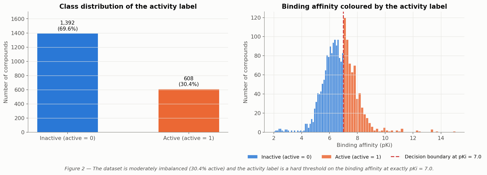

| Dataset summary | Value |
|---|---:|
| Compound–protein pairs | 2,000 |
| Columns | 17 |
| Active pairs | 608 (30.4%) |
| Training / held-out test rows | 1,600 / 400 |

## Project workflow

1. Audit the dataset and identify useful chemical and protein descriptors.
2. Benchmark classification models for the binary `active` label.
3. Benchmark regression models for continuous `binding_affinity` (pKi).
4. Select a decision threshold using out-of-fold training predictions.
5. Save the final pipelines and score new compound batches.

## Exploratory data analysis

The EDA found that `active` is exactly defined as `binding_affinity >= 7.0`. The strongest feature associations with affinity are `logp_pi_interaction` (Pearson correlation 0.751) and `logp` (0.602). Missing values affect `logp`, `polar_surface_area`, and `hydrophobicity` at 3% each. About 5.7% of rows contain at least one descriptor beyond three standard deviations.

These figures summarize data quality, the target relationship, feature associations, and the dataset's multivariate structure.

<p align="center">
  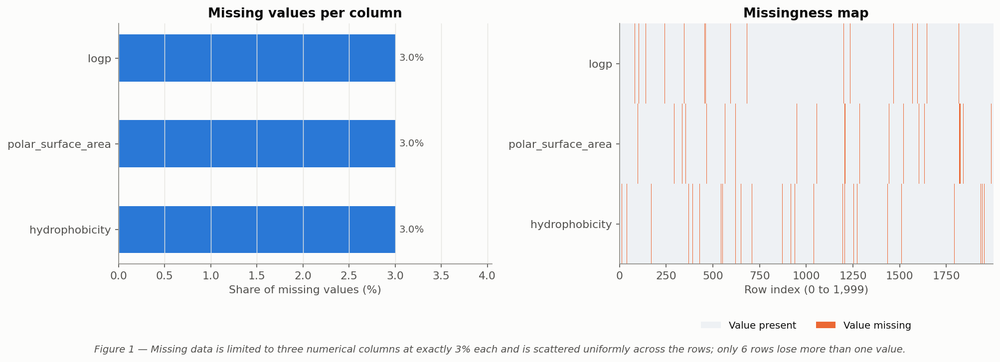
</p>

<p align="center">
  
</p>
<p align="center"><sub>Missing-value audit and target distribution.</sub></p>

<p align="center">
  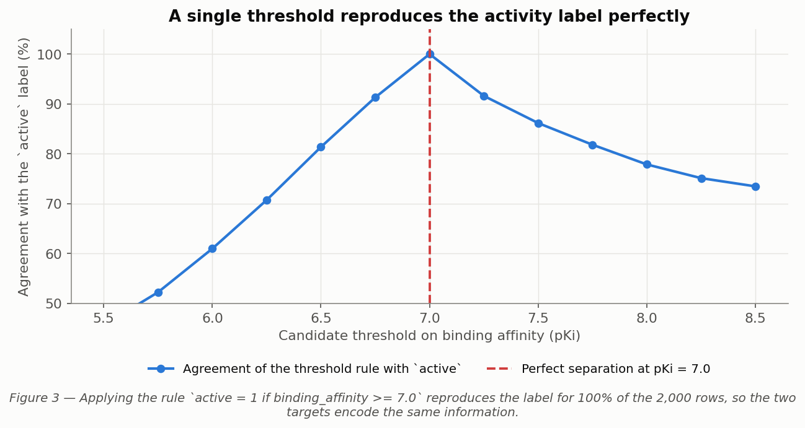
</p>

<p align="center">
  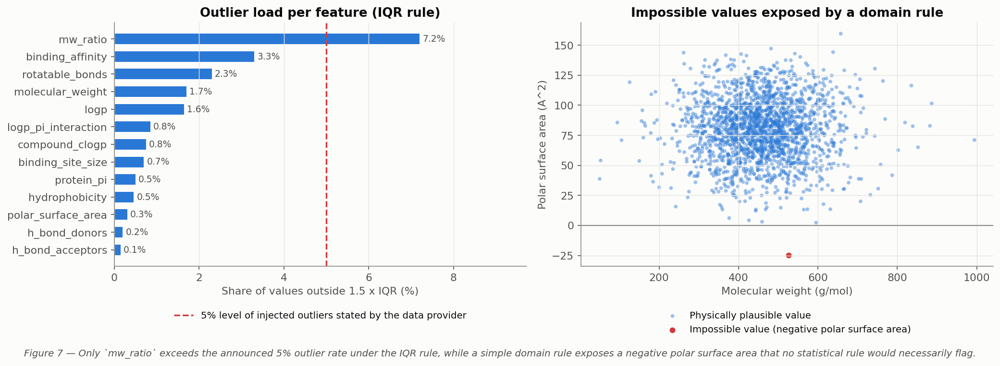
</p>
<p align="center"><sub>Target leakage check and descriptor outlier analysis.</sub></p>

<p align="center">
  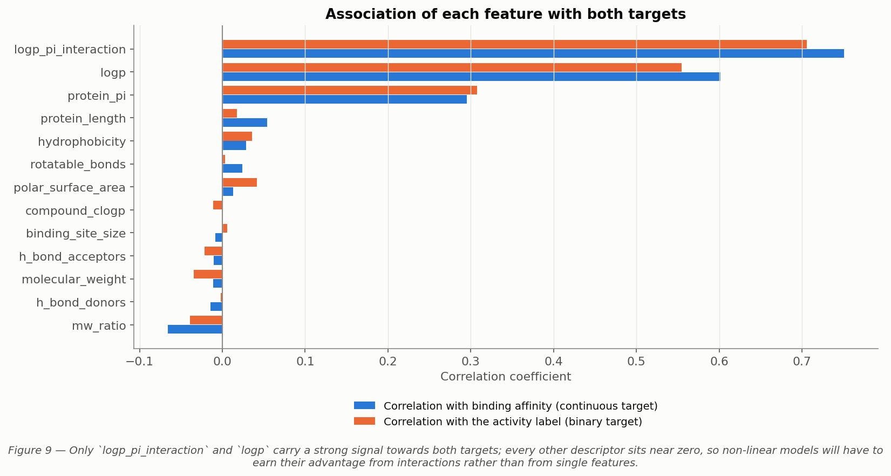
</p>

<p align="center">
  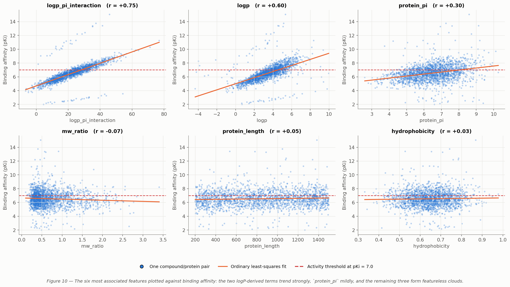
</p>
<p align="center"><sub>Feature–target associations and the strongest feature relationships.</sub></p>

<p align="center">
  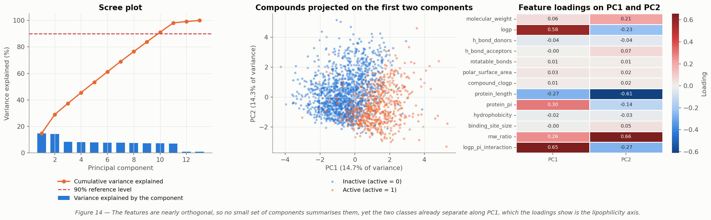
</p>

<p align="center">
  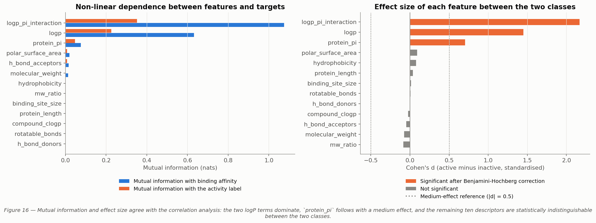
</p>
<p align="center"><sub>Multivariate structure and feature ranking.</sub></p>

## Machine learning models

The modeling notebook compares ten classifiers and ten regressors. Preprocessing is kept inside the pipelines, and the classification threshold is chosen from out-of-fold predictions on the training data. The held-out test set contains 400 rows.

### Final saved model performance

The values below describe the final saved artifacts in `models/`, as recorded in `models/model_metadata.json`.

| Task | Saved model | Metric | Held-out result |
|---|---|---|---:|
| Activity classification | Tuned Logistic Regression | ROC-AUC | 0.9578 |
| Activity classification | Tuned Logistic Regression | Average precision | 0.9265 |
| Activity classification | Tuned Logistic Regression | F1 at threshold 0.465 | 0.8122 |
| Binding-affinity regression | Linear Regression | RMSE (pKi) | 0.7392 |
| Binding-affinity regression | Linear Regression | MAE (pKi) | 0.3370 |
| Binding-affinity regression | Linear Regression | R² | 0.6155 |

The plots below show the broader benchmark, threshold selection, classifier diagnostics, regression results, and model interpretation.

<p align="center">
  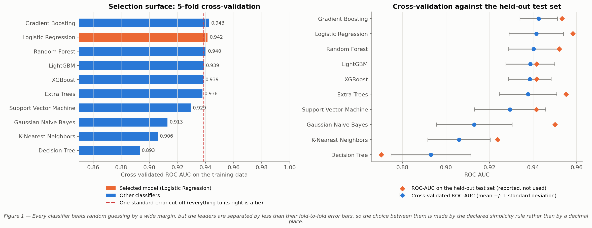
</p>

<p align="center">
  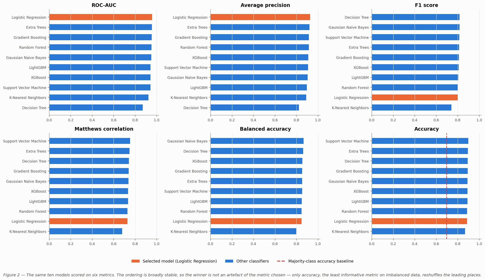
</p>
<p align="center"><sub>Classifier ranking and metric comparison.</sub></p>

<p align="center">
  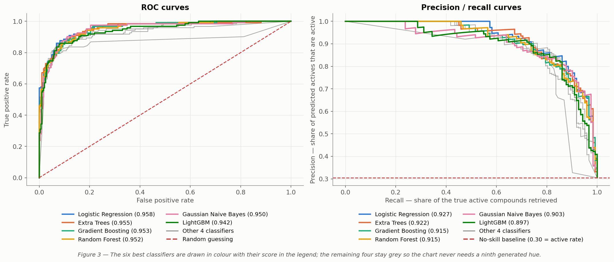
</p>

<p align="center">
  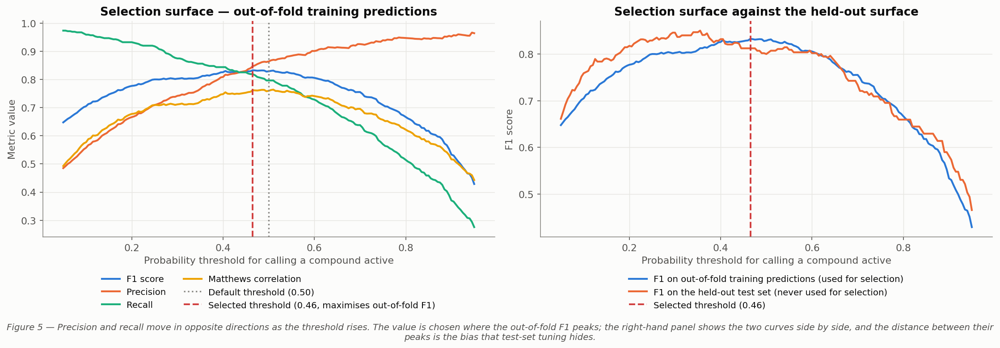
</p>
<p align="center"><sub>Classification curves and decision-threshold selection.</sub></p>

<p align="center">
  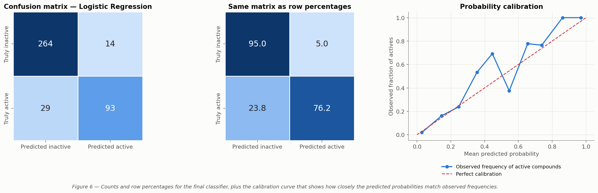
</p>

<p align="center">
  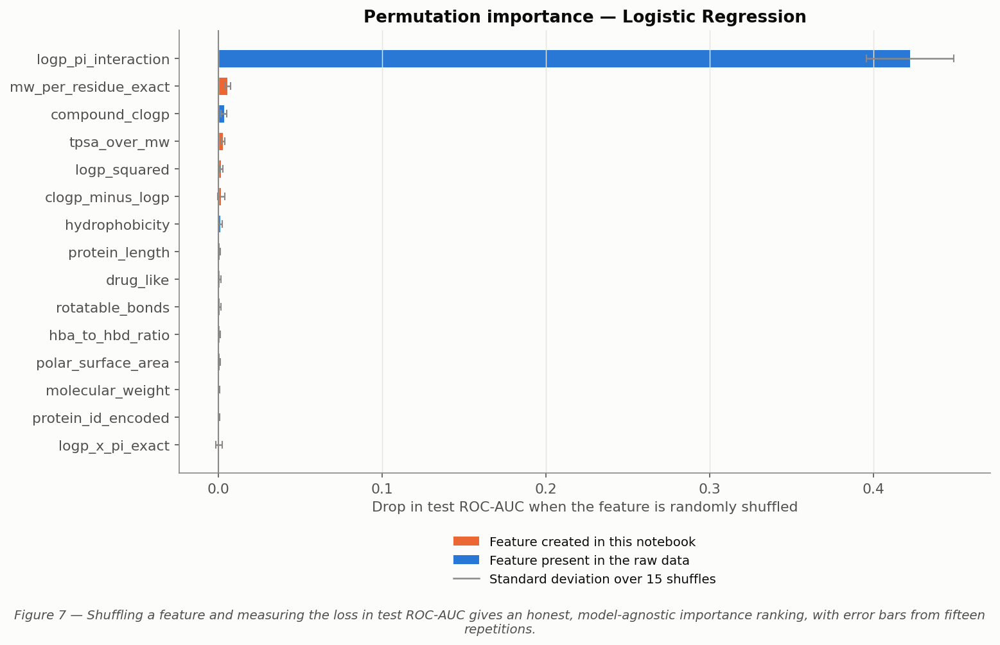
</p>
<p align="center"><sub>Classifier errors, calibration, and permutation importance.</sub></p>

<p align="center">
  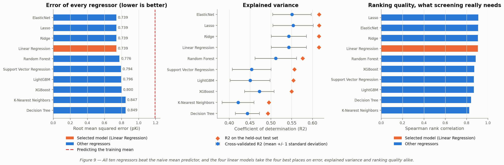
</p>

<p align="center">
  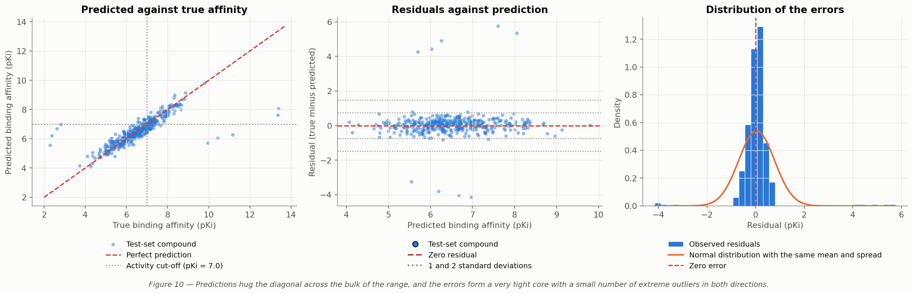
</p>
<p align="center"><sub>Regressor comparison and binding-affinity diagnostics.</sub></p>

<p align="center">
  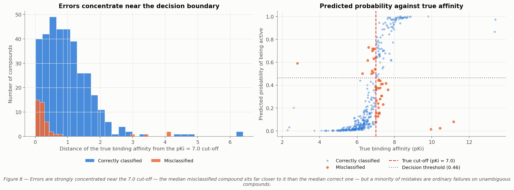
</p>

<p align="center">
  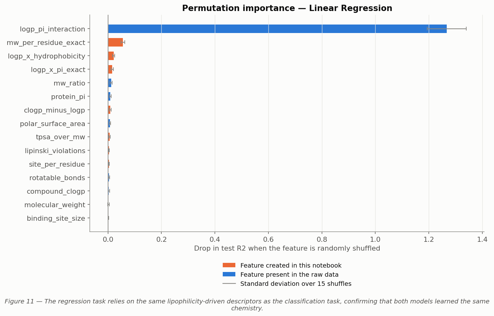
</p>
<p align="center"><sub>Classification error analysis and regression feature importance.</sub></p>

## Batch prediction

The batch workflow loads the saved model artifacts, generates an activity probability, a binary activity call, and a predicted binding affinity for each input row. It exports a full prediction table and a minimal binary file.

<p align="center">
  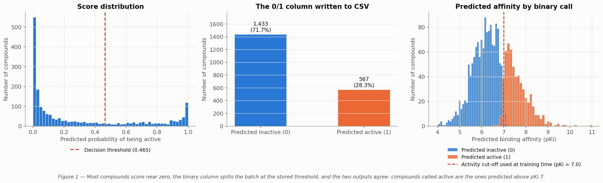
</p>

<p align="center">
  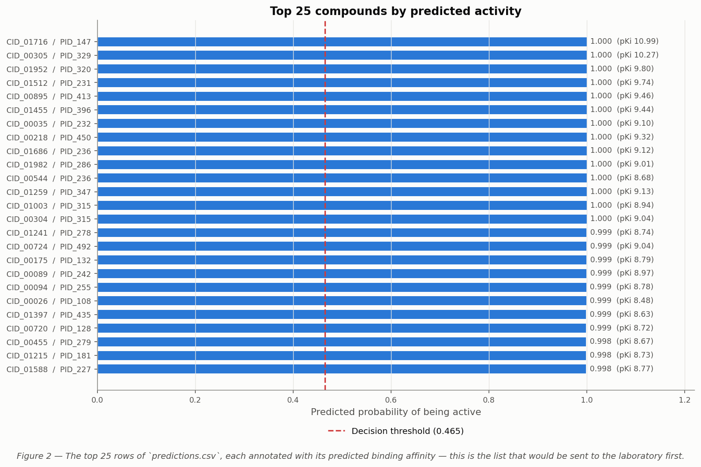
</p>
<p align="center"><sub>Batch score distribution and top-compound shortlist.</sub></p>

## Leakage controls and modeling notes

- `active` is exactly `binding_affinity >= 7.0`. `binding_affinity` must not be a classifier feature.
- `active` must not be a regressor feature.
- `compound_id` is a unique identifier and is dropped from the feature matrix.
- Missing numeric values are imputed inside the model pipeline; rows are not dropped for missing descriptors.
- `protein_id` is label-encoded. Unseen protein identifiers receive the reserved value `-1` during inference.
- Classification quality is reported with ROC-AUC, average precision, and F1, since the active class represents 30.4% of the dataset.

## Notebooks

Run notebooks from the repository root so their relative data and output paths resolve correctly.

1. [`01_exploratory_data_analysis.ipynb`](notebook/01_exploratory_data_analysis.ipynb) — data quality, target analysis, descriptor distributions, associations, outliers, drug-likeness, and modeling recommendations.
2. [`02_machine_learning_models.ipynb`](notebook/02_machine_learning_models.ipynb) — feature engineering, classifier and regressor benchmarks, threshold selection, evaluation, interpretation, and artifact export.
3. [`03_batch_prediction.ipynb`](notebook/03_batch_prediction.ipynb) — batch scoring, output generation, and prediction validation.

## Repository structure

```text
Drug-Discovery-Virtual/
├── img/                 # Figures embedded in this README
├── input/               # Reference input dataset
├── models/              # Final models, metadata, and inference script
│   └── all_models/      # Ten classifiers and ten regressors
├── notebook/            # EDA, model benchmark, and batch prediction
├── output/              # Analysis tables, figures, and prediction files
│   └── figures/         # Figures generated by the notebooks
├── src/                 # Supporting prediction source code
├── requirements.txt
└── README.md
```

## Installation

Use Python 3.12 or newer. The saved model artifacts were generated with Python 3.12.4 and scikit-learn 1.3.2. Keep the pinned scikit-learn version when loading the serialized models.

### Windows PowerShell

```powershell
python -m venv .venv
.\.venv\Scripts\Activate.ps1
python -m pip install --upgrade pip
python -m pip install -r requirements.txt
```

### Linux or macOS

```bash
python -m venv .venv
source .venv/bin/activate
python -m pip install --upgrade pip
python -m pip install -r requirements.txt
```

Start JupyterLab from the repository root to open the notebooks:

```bash
jupyter lab
```

`xgboost` and `lightgbm` are needed to reproduce the complete model benchmark. The two final saved pipelines can be used without those libraries. Model-specific dependencies are also listed in [`models/requirements.txt`](models/requirements.txt).

## Run predictions

Score a CSV and write the results to a chosen output path:

```bash
python models/predict.py input/drug_discovery_virtual_screening.csv output/predictions_scored.csv
```

When the output path is omitted, the script writes a file ending in `_scored.csv` next to the input file:

```bash
python models/predict.py path/to/compounds.csv
```

The same model can be called from Python:

```python
import pandas as pd

from models.predict import ScreeningModel

compounds = pd.read_csv("path/to/compounds.csv")
model = ScreeningModel()
predictions = model.predict(compounds)
predictions.to_csv("predictions_scored.csv", index=False)
```

### Required input columns

Each prediction row must provide these raw descriptors:

```text
protein_id
molecular_weight
logp
h_bond_donors
h_bond_acceptors
rotatable_bonds
polar_surface_area
compound_clogp
protein_length
protein_pi
hydrophobicity
binding_site_size
mw_ratio
logp_pi_interaction
```

`compound_id` is optional and is copied into the results when present. Missing descriptor values are handled by the fitted pipeline. Extra columns, including `active` and `binding_affinity`, are not used to produce predictions.

The result includes `activity_probability`, `predicted_active`, and `predicted_binding_affinity`, plus `compound_id` and `protein_id` when those identifiers are supplied. `predicted_active` uses the threshold stored with the classifier.

## Generated outputs

- `output/eda_*.csv` and `output/eda_summary.json` — EDA summaries and findings.
- `output/ml_*.csv` — benchmark metrics, feature-importance results, and threshold scans.
- `output/predictions.csv` and `output/predictions_binary.csv` — batch prediction results.
- `output/figures/` — figures generated by the notebooks; README figures are in `img/`.
- `models/best_classifier.joblib` and `models/best_regressor.joblib` — final serialized pipelines.
- `models/model_metadata.json` — input contract, feature order, threshold, metrics, and library versions.

## License

This project is distributed under the MIT License. See [`LICENSE`](LICENSE).
